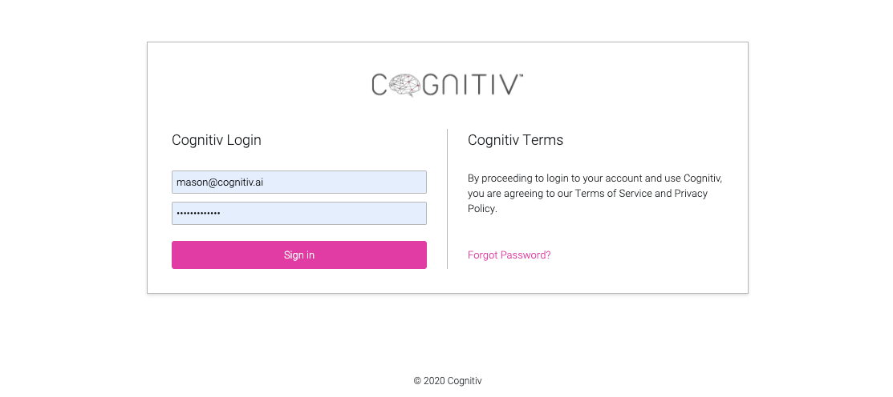

## Cognitiv React Redux Challenge

Fork the repo into your GitHub Account or download the package locally. Run 'yarn' to install the node modules. I recommend using Visual Studio Code if you dont already use it and install Beautify and ESLint extensions. All feedback is appreciated and please spend 3-4 hours on this challenge.

### Cognitiv Directions

After the node modules have been installed run the command 'npm start'. You will be building a psuedo login screen, navigation and a dashboard page. You will also be hooking up some basic Redux actions as well as a reusable input component. There will be no redline or design guidelines so make it as accurate as possible from the images.

### Login Page

Build the login page as accurately as possible. We are looking at the design as well as the code and how you manage coding patterns.

The login button will use the Button component located in the components directory. This will help guide you on the location for other reusable components for this mini project.

Make a reusable Input component that will allow a user to input text or a password. Have the input style look like the inputs in the image. Do not use a library for these inputs. Please develop the css from scratch along with the necessary props.

The Forgot Password link can be static and not do anything.

When a user clicks the 'Sign In' button:
- Activate the loading spinner with Redux
- Wait 3 seconds
- Set the user with Redux
- Redirect to the /dashboard page
- Deactivate the loading action with Redux

To make this action happen you will need to create a user reducer in the ducks folder. The key to authenticate a user will be to pass an arbitrary authentication key to the user reducer. Look inside the routes directory for information on how users are authenticated inside this repo.

### Dashboard Page

After the user has been authenticated they will land on the Dashboard Page. The only requirement for this page is to have a button somewhere that will allow a user to "logout". The logout button should be hooked up to Redux and clear the user. If you have any questions reach out to your recruiter.

Thank you for taking the time to complete this challenge and we look forward to speaking again!